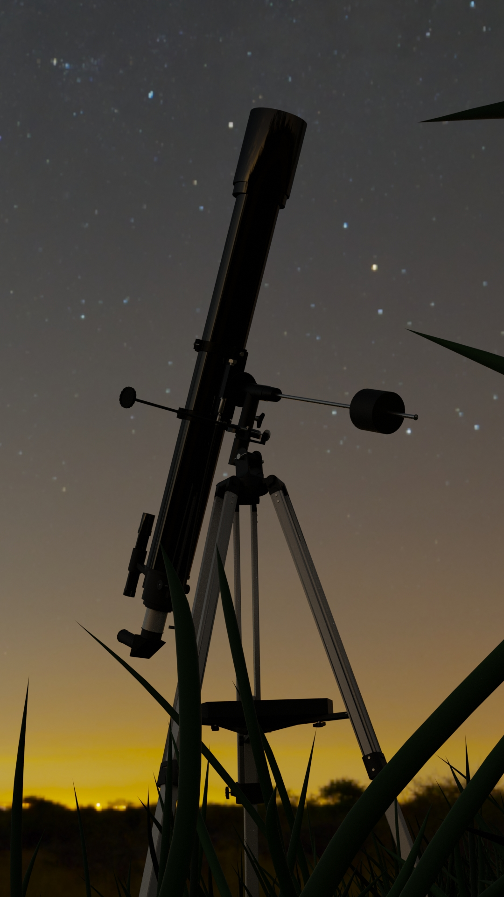

# My 3D Works

Welcome to my collection of 3D projects! This repository showcases my creations in 3D using Blender from the time when I was exploring 3D modeling (I still do, but not that often ;) )

## Vinyl player

This is a vinyl player based on the Fluance RT81 Elite High Fidelity Vinyl Turntable 

## Telescope

This is another model based on the real product: Sky Watcher's beautiful simple telescope BK 909AZ3

## Sword

My main goal with this one was to practice sculpting in blender using my graphic tablet, a very fast project

## Isometric sauna

Idea came to me when I was very much enjoying Finnish sauna :^) another pretty fast project

## Room

This project I had been making for a few years, slowly adding more and more object to the scene when I was 14-16 years old. Still not finished but it contains different other projects (which renders I have lost :,) ) such as: projector, laptop, instax camera and other little objects

## Contact

If you have any questions, here is my email!
>labean0103@gmail.com

